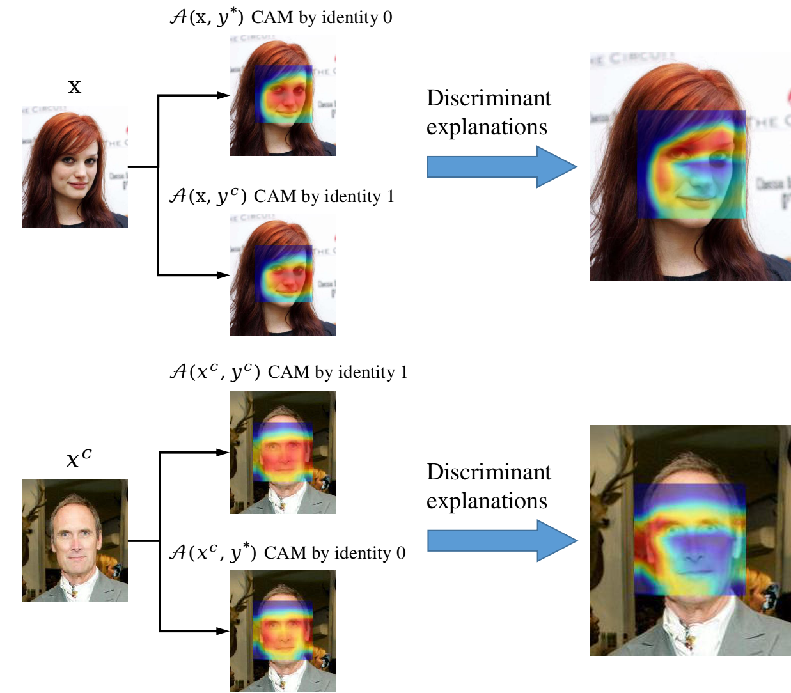

# SCOUT-Face

Implement of CVPR 2020 paper: [SCOUT: Self-aware Discriminant Counterfactual Explanations](https://openaccess.thecvf.com/content_CVPR_2020/html/Wang_SCOUT_Self-Aware_Discriminant_Counterfactual_Explanations_CVPR_2020_paper.html)

The official implement: [https://github.com/peiwang062/SCOUT](https://github.com/peiwang062/SCOUT)

This project adopt the method of SCOUT, and implement with pytorch, however the code is written by third party, there may be hidden dangers and knowledge loopholes.

Connect: [Ruoyu Chen](https://ruoyuchen10.github.io/)

## 1. Environment

> pytorch 1.7.1
>
> tensorflow-gpu 1.15
>
> opencv-python
>
> argparse
>
> scikit-image
>
> pillow
>
> tqdm

The algorithm is based on pytorch, if need using **MTCNN** to detect 5 landmark, need tensorflow.

Now only support GPU version for pytorch, however it's easy to change to CPU version only.

```shell
git clone https://github.com/RuoyuChen10/SCOUT-Face.git
cd SCOUT-Face
```

Create a virtual environment:

```shell
conda create -n <Your-env-name> python=3.7
conda activate <Your-env-name>
```

Install packages

If you needn't landmark detection or have more convenient method, need install tensorflow. Or install tensorflow 1 and then clone a portable lib:

```shell
git clone https://github.com/RuoyuChen10/MTCNN_Portable.git
```

## 2. Contribute Network

Adopt [VGGFace2](https://github.com/ox-vgg/vgg_face2) datasets, can be download [here](https://www.graviti.cn/open-datasets/VGGFace2)

The pytorch implement model come from [here](https://github.com/cydonia999/VGGFace2-pytorch), copy the models and download [pre-trained weight](https://drive.google.com/file/d/1gy9OJlVfBulWkIEnZhGpOLu084RgHw39/view) put into checkpoint dir.

## 3. RUN Demo

**Options:**

- `--network` Network model, default using VGGFace2 with resnet50 backbone, you can add more network in function `get_net`.
- `--image-path-1` The first identity person image path.
- `--image-path-2` The second identity person image path.
- `--class-id-1` The first person identity class index, `None` can using the argmax index.
- `--class-id-2` The second person identity class index, `None` can using the argmax index.
- `--weight-path` Weight path of the model, default weight path in function `get_net`, if is none will load the weight path in `get_net`.
- `--attribution-maps` Method to generate heatmap, include GradCAM and GradCAM++, default by GradCAM.
- `--layer-name` The last convolutional layer name, if `None` will judge by `torch` function.
- `--output-dir` The directory to save results.

**Watch out:**

In the paper, author propose the confidence scores as map computing:

$$
s^{e}(x)=1-s^{hp}(x)
$$

The author suggest using function (13) as confidence scores:

$$s^{e}(x)=1-s^{hp}(x)$$

Due to no time to retrain an additional layer, I using function (11) as the confidence scores:

$$
s^{s}(x)=\underset{y}{max}h_{y}(x)
$$

**Example:**

```shell
python Compute_heatmap_group.py \
    --image-path-1 ./input/0001_01.jpg \
    --image-path-2 ./input/0012_01.jpg \
    --class-id-1 0 \
    --class-id-2 1 \
    --output-dir ./results/
```


